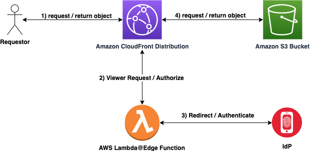

# Amazon CloudFront and Lambda@Edge OIDC Function

## Purpose

Create a globally-distributed Amazon CloudFront Distribution (CDN) that will securely serve-up static files from an Amazon S3 Bucket using OpenID Connect. The purpose of this repository is to allow organizations or users to integrate with their preferred OpenID Connect compliant Identity Provider (IdP). 

## Pre-requisites

- [AWS SAM CLI is Installed](https://docs.aws.amazon.com/serverless-application-model/latest/developerguide/serverless-sam-cli-install.html)
- [AWS Credentials are setup in your Environment](https://docs.aws.amazon.com/sdk-for-java/v1/developer-guide/setup-credentials.html)
- [An S3 Bucket is created in your AWS account in the Same Region you are deploying to](https://docs.aws.amazon.com/AmazonS3/latest/userguide/create-bucket-overview.html)
- [Python3 is Installed in your Environment](https://www.python.org/downloads/)
- [Pip3 is Installed in your Environment](https://pip.pypa.io/en/stable/installation/)

## Steps For Setup

The following set of steps should be followed to deploy this solution:

1. [Create a base AWS Secrets Manager Secret Configuration](docs/baseconfiguration.md)
2. [Deploy the AWS SAM Stack](docs/deploy.md)
3. [Set up Registered OIDC Application](docs/registerapplication.md)
4. [Generate OIDC Configuration](docs/configuration.md)
5. [Update AWS Secrets Manager](docs/secretsmanager.md)
6. [Navigate to Amazon CloudFront URL / Troubleshoot](docs/cloudfront.md)

## Configuration CLI

For more details about generating the configuration file for AWS Secrets Manager please refer to [CLI Documentation](cli/README.md)

## Request Flow

1. User requests content from Amazon CloudFront Distribution
2. AWS Lambda@Edge Viewer Request invoked
	1. If valid authentication cookie present in header, redirect to Amazon S3 Bucket.
	2. If no authentication cookie is present or expired/invalid cookie header is present, continue to step 3.
3. AWS Lambda@Edge Function redirects request to IdP for Authentication request.
	1. If Authentication challenge fails - deny access and exit.
	2. If Authentication challenge succeeds - continue on.
4. Retrieve object from Amazon S3 bucket and return content to requestor via Amazon CloudFront Distribution. User is happy :)

### TL;DR

#### This will create the following AWS infrastructure

- S3 Data Bucket
- S3 Logging Bucket
- CloudFront Distribution
- Lambda@Edge Function for OIDC Auth

## Troubleshooting

Please refer to this [document](docs/cloudfront.md) for Troubleshooting common scenarios. Open a GitHub issue if this does not help!

## Identity Provider (IdP) Setup Instructions
- [Amazon Cognito Application Registration](docs/cognito.md)
- [Okta Application Registration](docs/okta.md)

## Security

See [CONTRIBUTING](CONTRIBUTING.md#security-issue-notifications) for more information.

## License

This library is licensed under the MIT-0 License. See the LICENSE file.

## Contributors

- Viyoma Sachdeva
- Matt Noyce
